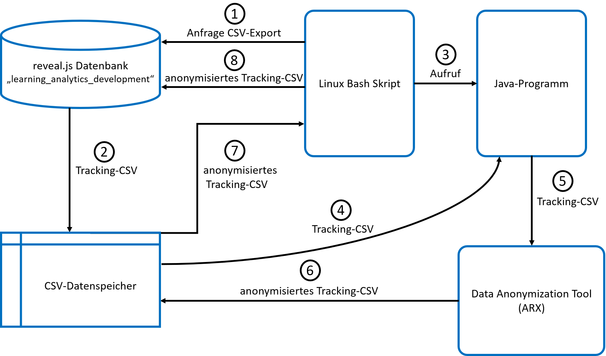

# anonymizeReveal.js

This application anonymizes reveal.js tracking data from the [reveal.js tracking plugin](https://github.com/pantajosef/reveal.js-tracking) by using the ARX anonymisation tool. Currently the data is being 2-anonymized but all the anonymisation parameters can be modified in [LAnonymizer.java](https://github.com/jquku/anonymizeReveal.js/blob/master/LAnonymizer.java) manually. This application contains a shell script and therefore cannot be used
for windows or macOS. 

## Software architecture

